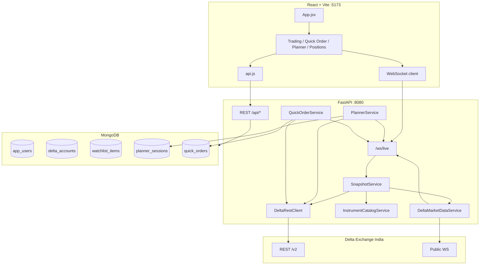
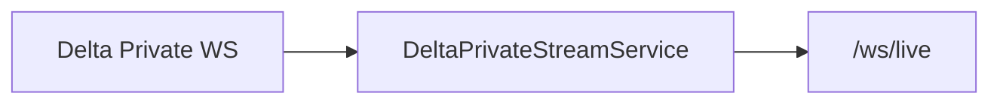

# CryptoBridge Architecture

## Overview

CryptoBridge is a full-stack trading workspace for **Delta Exchange India**. The frontend provides a SignalBridge-style control room; the backend owns all Delta integration, market data, automation, and live state delivery.

**Complete feature list:** [FEATURES.md](./FEATURES.md)  
**Change history:** [CHANGELOG.md](./CHANGELOG.md)  
**Doc maintenance rules:** [DOCUMENTATION-POLICY.md](./DOCUMENTATION-POLICY.md)

---

## Frontend

**Stack:** React 18, Vite 8, Tailwind CSS 3, `lightweight-charts`

**Pages:** Dashboard, Execution, **ST Options**, Active Positions — routed in `App.jsx` via `currentPage`.

**Key modules:**

| Path | Role |
|------|------|
| `App.jsx` | Auth, global state, WebSocket lifecycle, page switch |
| `api.js` | REST + `openLiveSocket()` |
| `utils/liveMerge.js` | Snapshot merge, account normalization |
| `components/dashboard/*` | Portfolio dashboard |
| `components/execution/*` | Spot-triggered option execution |
| `components/st-options/*` | 1H SuperTrend options sell (live + backtest) |
| `components/positions/*` | Active positions |

**State:** Token in `localStorage`; live data via `/ws/live`; REST for mutations.

---

## Backend

**Stack:** Python 3.9+, FastAPI, uvicorn, Motor, httpx, websockets

**Layout (`backend-python/cryptobridge/`):**

| Module | Role |
|--------|------|
| `routers/` | REST + `/ws/live` |
| `services/` | Auth, accounts, orders, positions, snapshot, execution engine, **ST Options** |
| `delta/` | `DeltaRestClient`, `DeltaMarketDataService` |
| `utils/` | `risk_sizing`, `candle_levels`, `price_precision`, crypto, signing |
| `config.py` | pydantic-settings |

Legacy Java WebFlux mirror lives in `backend-webflux/` — same API contract, not started by `scripts/run-backend`.

---

## System Diagram



---

## Delta Integration

### Account onboarding

1. `POST /api/accounts` → signed `GET /v2/profile`
2. Secret encrypted (AES-GCM); wallet via `GET /v2/wallet/balances`
3. Margin: prefer USD/USDT/INR `available_balance`; fallback `meta.net_equity`

### Live pricing

1. Backend WS to `DELTA_PUBLIC_WS_URL`
2. Subscribe `ticker` + `ob_l1` for all watchlist symbols (global union)
3. `PriceBroadcaster` → `/ws/live` `type: price` with `price_digits` from catalog/watchlist

### Price precision

1. `InstrumentCatalogService` loads all live products → `tick_size` → `price_digits`
2. Watchlist items store `priceDigits`; backfilled on connect
3. Never infer decimals from live price magnitude

### Charts

`GET /api/chart/candles` → Delta `GET /v2/history/candles` (sorted ascending)

### Orders

`POST /api/orders` → product lookup → risk sizing → signed `POST /v2/orders` (bracket TP/SL)

### Quick Order

Completed candle → entry/SL ± tick → max risk cap ($10 / 1%) → place via `OrderService`

### Planner

Per-session async loop (15s / 5s) → `planner_engine` state machine → `PlannerExecutionService` → Delta orders

---

## Live WebSocket Message Types

Connect: `ws://host/ws/live?token=<sessionToken>`

| type | When | Key fields |
|------|------|------------|
| `snapshot` | On connect | `me`, `accounts`, `watchlist`, `prices`, `orders`, `running_pl`, `live` |
| `price` | Each ticker/L1 | `symbol`, `tick.price`, `tick.price_digits`, `tick.bid`, `tick.ask` |
| `planner` | Planner tick | `session` (full PlannerSessionView) |
| `quick_order` | Quick order sync/place | `order` (QuickOrderView) |

Example `price` tick:

```json
{
  "type": "price",
  "symbol": "SOLUSD",
  "tick": {
    "symbol": "SOLUSD",
    "price": 145.678,
    "bid": 145.670,
    "ask": 145.685,
    "price_digits": 3,
    "change24h": 1.2,
    "time": "2026-06-22T12:00:00+00:00"
  }
}
```

---

## Background Processing

| Component | Interval | Purpose |
|-----------|----------|---------|
| `DeltaMarketDataService` | WS | Public market feed |
| `PositionsService` | WS ticks + 15s MTM | Open positions broadcast |
| `ExecutionEngineService` | Poll | Spot-triggered option monitors |
| `StOptionsService` | ~15s poll | 1H ST Options entries; broker SL/TP bracket reconciliation; ST-flip/manual/expiry exits; async backtest |

For each live ST Options entry, the service writes the open trade, attaches Delta position-bracket SL/TP orders, and persists both leg IDs. Polling reconciles a filled broker leg into Mongo without submitting another reduce order. Intentional strategy exits cancel pending legs before a market reduce; a bracket-attachment failure falls back to service-side premium monitoring.

---

## Security

- BCrypt passwords; UUID session tokens (7-day TTL)
- Delta secrets: AES-GCM (`CRYPTOBRIDGE_CRYPTO_SECRET`)
- CORS: configurable via `CORS_ALLOW_ORIGIN_REGEX` (default allows any host/IP for dev/LAN/public access)
- WS auth: `?token=` validated on connect

---

## Planned (Phase 1+)

Private Delta WebSocket for orders, positions, fills, margins — see [delta-api-capabilities.md](./delta-api-capabilities.md).



New event types (planned): `order`, `fill`, `position`, `margin`
