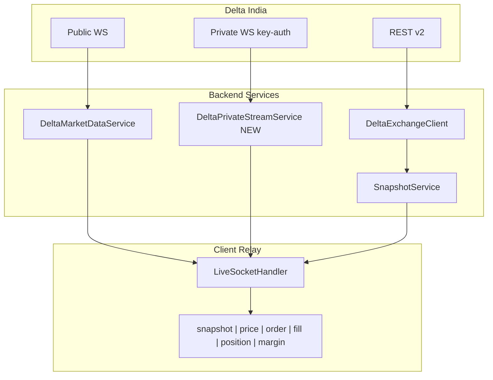

# Delta Exchange India API — Capabilities Reference

Project-local reference for Delta Exchange API v2. Use this document to answer **“Does Delta support X?”** and **“Have we built X in CryptoBridge?”** without re-reading external docs.

**Official docs:** [docs.delta.exchange](https://docs.delta.exchange/)

**CryptoBridge defaults (India):**

| Service | URL |
|---------|-----|
| REST production | `https://api.india.delta.exchange` |
| REST testnet | `https://cdn-ind.testnet.deltaex.org` |
| Public WebSocket | `wss://public-socket.india.delta.exchange` |
| Private WebSocket | `wss://socket.india.delta.exchange` |

> **Note:** `api.delta.exchange` is Delta **Global**. India API keys require the India endpoints above.

Configure via `cryptobridge.delta-api-base-url` (backend) and related env vars.

---

## Coverage Summary

| Status | Count | Description |
|--------|-------|-------------|
| **Done** | 10 REST + 1 WS channel | Integrated in CryptoBridge today |
| **Partial** | 3 | Used indirectly or incomplete UI |
| **Not started** | 40+ REST + 16 WS channels | Documented for future phases |

See [Implementation Roadmap](#implementation-roadmap) for phased build priorities.

---

## Platform Fundamentals

### Authentication

**REST (HMAC-SHA256)** — all signed requests:

| Header | Description |
|--------|-------------|
| `api-key` | API key string |
| `signature` | Hex HMAC-SHA256 |
| `timestamp` | Unix seconds |
| `User-Agent` | Required (e.g. `CryptoBridge/0.1`) |

```
signature = HMAC-SHA256(secret, method + timestamp + requestPath + queryString + body)
```

- Body must be valid JSON with `Content-Type: application/json`
- Signature valid for **5 seconds**
- Trading keys require **IP whitelisting**

**CryptoBridge (Python):** `DeltaRestClient` signs via an httpx **request hook** at wire-send time (`cryptobridge/delta/request_signing.py`), not when the coroutine enqueues the call — avoids stale timestamps under connection-pool contention. Retries once on `expired_signature` and adjusts a clock offset from Delta's `request_time` / `server_time` context. Host clock should stay NTP-synced (Windows Time on EC2).

**WebSocket keepalive:** Delta uses JSON heartbeat (`enable_heartbeat` + `{"type":"ping"}`), not RFC6455 protocol pings. CryptoBridge connects with `ping_interval=None` on both public and private sockets.

**WebSocket (private channels):**

| Method | Status | Details |
|--------|--------|---------|
| `key-auth` | Recommended | `HMAC-SHA256(secret, 'GET' + timestamp + '/live')` |
| `auth` | Deprecated | Stops working **31 Dec 2025** |

Unsubscribe all private channels: `{"type":"unauth","payload":{}}`

CryptoBridge implements REST signing in `DeltaRestClient` (`request_signing.py` send-time hook). Private WS auth is live in `DeltaPrivateStreamService`.

### Response Format

**Success:**
```json
{ "success": true, "result": {}, "meta": { "after": "...", "before": null } }
```

**Error:**
```json
{ "success": false, "error": { "code": "insufficient_margin", "context": {} } }
```

- Timestamps: **microseconds** in many fields (REST candle `start`/`end` use **seconds**)
- Decimals: returned as **strings**
- IDs: big integers; UUIDs with or without dashes

### Pagination

Cursor-based on: `/v2/products`, `/v2/orders`, `/v2/orders/history`, `/v2/fills`, `/v2/wallet/transactions`

Params: `after`, `before`, `page_size`

### Rate Limits

| Limit | Value |
|-------|-------|
| REST quota | 10,000 weight / 5-minute window |
| On exceed | HTTP 429; header `X-RATE-LIMIT-RESET` |
| Product engine | 500 ops/s per product |
| WS connections | 150 / IP / 5 minutes |
| WS inactivity | 60-second timeout |
| Batch orders | Max 50 per batch (same contract) |
| Multi-symbol queries | Max 10 comma-separated symbols/IDs |
| Historical candles | Max 2000 per response |
| `ob_l2` / `ob_updates` | Max 100 symbols per connection |

**Endpoint weights:** Products/Tickers/Orders(open)/Positions/Balances/Candles = 3; Place/Edit/Delete Order = 5; History/Fills = 10; Batch = 25

### Symbology

| Concept | Example |
|---------|---------|
| Product symbol | `BTCUSD`, `C-BTC-75000-310325` |
| Product ID | `27` (used in some order APIs) |
| Mark price candles | `MARK:BTCUSD` |
| Funding history | `FUNDING:BTCUSD` |
| Open interest | `OI:ETHUSD` |
| Index / spot price | `.DEXBTUSD` |
| Option chain shorthand (WS) | `BTC-310326` (ASSET-DDMMYY) |

---

## REST API Catalog

Status key: **Done** | **Partial** | **Not started** | Phase tag in parentheses

### Assets & Indices

| Method | Path | Auth | Purpose | Key params | Status |
|--------|------|------|---------|------------|--------|
| GET | `/v2/assets` | No | All assets, deposit/withdraw status, fees | — | Not started (P4) |
| GET | `/v2/indices` | No | Spot price indices, constituents, weights | — | Not started (P5) |

### Products & Market Snapshots

| Method | Path | Auth | Purpose | Key params | Status |
|--------|------|------|---------|------------|--------|
| GET | `/v2/products` | No | All trading products | `contract_types`, `states`, `expiry`, `after`, `before`, `page_size` | **Done** — paginated cache in `InstrumentCatalogService` |
| GET | `/v2/products/{symbol}` | No | Single product metadata | symbol | **Done** — `fetchProduct`, order/risk flows |
| GET | `/v2/tickers` | No | All/filtered live tickers | `contract_types`, `underlying_asset_symbols`, `expiry_date` | Not started (P5 — option chain) |
| GET | `/v2/tickers/{symbol}` | No | Ticker for symbol(s), max 10 | comma-separated symbols | **Done** — `fetchTicker`, watchlist add, symbol resolve |

### Historical Data

| Method | Path | Auth | Purpose | Key params | Status |
|--------|------|------|---------|------------|--------|
| GET | `/v2/history/candles` | No | OHLCV history | `resolution`, `symbol`, `start`, `end` (seconds) | **Done** — chart; Calendar Spread / Move Straddle / **HA Dir. Options** backtests (`CandleCacheService`); **note: API returns descending time; backend sorts ascending** |
| GET | `/v2/history/sparklines` | No | Compact price history | `symbols` (comma-separated) | Not started (P5) |

**Candle resolutions:** `1m`, `3m`, `5m`, `15m`, `30m`, `1h`, `2h`, `4h`, `6h`, `12h`, `1d`, `1w` (deprecated: `7d`, `2w`, `30d`). **No native `90m` REST resolution** — Directional Options FSM aggregates six `15m` bars into IST-aligned 90m buckets (opens 01:00, 02:30, …, 23:30 IST; see [FEATURES.md](./FEATURES.md) §9).

### Public Market Microstructure

| Method | Path | Auth | Purpose | Key params | Status |
|--------|------|------|---------|------------|--------|
| GET | `/v2/l2orderbook/{symbol}` | No | L2 orderbook snapshot | `depth` | Not started (P2) |
| GET | `/v2/trades/{symbol}` | No | Recent public trades | pagination | Not started (P2) |

### Orders

| Method | Path | Auth | Purpose | Key params / body | Status |
|--------|------|------|---------|-------------------|--------|
| POST | `/v2/orders` | Yes | Place order | `product_id`/`product_symbol`, `size`, `side`, `order_type`, `limit_price`, stop/bracket fields, `time_in_force`, `post_only`, `reduce_only`, `mmp` | **Done** — market/limit/stop/bracket via `OrderService` |
| PUT | `/v2/orders` | Yes | Edit order | order id, price, size | Not started (P1) |
| DELETE | `/v2/orders` | Yes | Cancel order | `id`, `client_order_id`, or `product_id` | **Done** — `cancelOrder` |
| DELETE | `/v2/orders/all` | Yes | Cancel all open orders | filters: `product_id`, `contract_types`, order type flags | Not started (P1) |
| POST | `/v2/orders/batch` | Yes | Batch create (max 50) | array of create requests | Not started (P3) |
| PUT | `/v2/orders/batch` | Yes | Batch edit | array of edit requests | Not started (P3) |
| DELETE | `/v2/orders/batch` | Yes | Batch cancel | array of delete requests | Not started (P3) |
| POST | `/v2/orders/bracket` | Yes | Place bracket order | entry + TP/SL | **Partial** — fields in `buildDeltaPayload`, no dedicated bracket endpoint |
| PUT | `/v2/orders/bracket` | Yes | Edit bracket order | — | Not started (P3) |
| GET | `/v2/orders` | Yes | Active orders | `product_ids`, `states`, `contract_types`, pagination | **Done** — snapshot + `OrderController.active` |
| GET | `/v2/orders/{order_id}` | Yes | Order by ID | — | Not started (P1) |
| GET | `/v2/orders/client_order_id/{client_oid}` | Yes | Order by client ID | — | Not started (P1) |
| POST | `/v2/products/{product_id}/orders/leverage` | Yes | Set leverage | leverage value | Not started (P3) |
| GET | `/v2/products/{product_id}/orders/leverage` | Yes | Get leverage | — | Not started (P3) |

### Positions

| Method | Path | Auth | Purpose | Key params | Status |
|--------|------|------|---------|------------|--------|
| GET | `/v2/positions/margined` | No | Full position + margin, liq prices (~10s lag) | `product_ids`, `contract_types` | **Partial** — fetched for running P/L sum only |
| GET | `/v2/positions` | Yes | Real-time size & entry only | `product_id` or `underlying_asset_symbol` | Not started (P1) |
| PUT | `/v2/positions/auto_topup` | Yes | Enable/disable auto top-up | position id | Not started (P3) |
| POST | `/v2/positions/change_margin` | Yes | Add/remove isolated margin | amount, side | Not started (P3) |
| POST | `/v2/positions/close_all` | Yes | Close all positions | — | Not started (P1) |

### Trade History

| Method | Path | Auth | Purpose | Key params | Status |
|--------|------|------|---------|------------|--------|
| GET | `/v2/orders/history` | Yes | Closed/cancelled orders | `product_ids`, time range, pagination | **Done** — `PositionsService` history |
| GET | `/v2/fills` | Yes | User fills | fill type, role, pagination | **Done** — `DeltaRestClient.fetch_fills` (available; history uses orders) |
| GET | `/v2/fills/history/download/csv` | Yes | CSV export of fills | filters | Not started (P1) |

### Wallet

| Method | Path | Auth | Purpose | Key params | Status |
|--------|------|------|---------|------------|--------|
| GET | `/v2/wallet/balances` | Yes | Balances per asset | — | **Done** — account enrichment |
| GET | `/v2/wallet/transactions` | Yes | Transaction history | `asset_ids`, `transaction_types`, pagination | Not started (P4) |
| GET | `/v2/wallet/transactions/download` | Yes | Download transactions | filters | Not started (P4) |
| POST | `/v2/wallets/sub_account_balance_transfer` | Yes | Subaccount transfer | `transferrer_user_id`, `transferee_user_id`, `asset_symbol`, `amount` | Not started (P4) |
| GET | `/v2/wallets/sub_accounts_transfer_history` | Yes | Transfer history | pagination | Not started (P4) |

### Account & Preferences

| Method | Path | Auth | Purpose | Status |
|--------|------|------|---------|--------|
| GET | `/v2/profile` | Yes | User profile | **Done** — account onboarding |
| GET | `/v2/sub_accounts` | Yes | List subaccounts | Not started (P4) |
| GET | `/v2/users/trading_preferences` | Yes | Trading prefs, MMP config | Not started (P4) |
| PUT | `/v2/users/trading_preferences` | Yes | Update preferences | Not started (P4) |
| PUT | `/v2/users/margin_mode` | Yes | Isolated/cross margin mode | Not started (P3) |
| GET | `/v2/rate_limits/quota` | Yes | Current quota usage | Not started (P4) |

### MMP (Market Maker Protection)

| Method | Path | Auth | Purpose | Status |
|--------|------|------|---------|--------|
| PUT | `/v2/users/update_mmp` | Yes | Update MMP config per asset | Not started (P6) |
| PUT | `/v2/users/reset_mmp` | Yes | Reset MMP freeze | Not started (P6) |

### Deadman Switch (Heartbeat)

| Method | Path | Auth | Purpose | Status |
|--------|------|------|---------|--------|
| POST | `/v2/heartbeat/create` | Yes | Register heartbeat + auto-action | Not started (P6) |
| POST | `/v2/heartbeat` | Yes | Send heartbeat ack | Not started (P6) |
| GET | `/v2/heartbeat` | Yes | List active heartbeats | Not started (P6) |

### Stats & Settlement

| Method | Path | Auth | Purpose | Status |
|--------|------|------|---------|--------|
| GET | `/v2/stats` | No | Exchange volume stats | Not started |
| GET | `/v2/products?states=expired` | No | Settlement prices for expired products | **Done** — OBW backtest (`fetch_expired_option_products`) |

---

## WebSocket Catalog

### Connection Protocol

**Subscribe:**
```json
{
  "type": "subscribe",
  "payload": {
    "channels": [{ "name": "ticker", "symbols": ["BTCUSD", "ETHUSD"] }]
  }
}
```

- Omitting `symbols` on most channels → **no data**
- `["all"]` subscribes to all contracts (no snapshot for `"all"`)
- Option chain: `"BTC-310326"` for all options expiring that date

**Health:** `{"type":"enable_heartbeat"}` (server ping every 30s); client `{"type":"ping"}` → `{"type":"pong"}`

### Public Channels

Endpoint: `wss://public-socket.india.delta.exchange`

| Channel | Purpose | Interval / limits | Status |
|---------|---------|-------------------|--------|
| `ticker` | 24h change, quotes, mark, greeks, OI, spot | ~5s | **Done** — `DeltaMarketDataService` |
| `ob_l1` | Best bid/ask (L1) | 100ms; max repeat 5s | Not started (P2) |
| `ob_l2` | Top 15 book levels | 500ms; max 100 symbols | Not started (P2) |
| `ob_updates` | Full book + incremental (seq, CRC32) | 100ms; max 100 symbols | Not started (P2) |
| `trades` | Public trade tape | realtime | Not started (P2) |
| `mark_price` | Mark price (`MARK:SYMBOL`) | 2s | Not started (P5) |
| `candlestick_{resolution}` | Live OHLC (`SYMBOL` or `MARK:SYMBOL`) | per resolution | Not started (P2) |
| `spot_price` | Index prices (`.DEXBTUSD`) | realtime | Not started (P5) |
| `spot_30mtwap_price` | 30m TWAP index (options settlement) | — | Not started (P5) |
| `funding_rate` | Perpetual funding rates | — | **Done** — `DeltaMarketDataService.latest_funding` feeds arbitrage funding |
| `product_updates` | Auction / market disruption events | — | Not started (P6) |
| `system_status` | Maintenance + system state | snapshot + events | Not started (P6) |

**Candlestick resolutions:** `1m`, `3m`, `5m`, `15m`, `30m`, `1h`, `2h`, `4h`, `6h`, `12h`, `1d`, `1w`

### Private Channels

Endpoint: `wss://socket.india.delta.exchange` + `key-auth`

| Channel | Purpose | Status |
|---------|---------|--------|
| `margins` | Wallet / margin updates per asset | **Done** — `DeltaPrivateStreamService` |
| `positions` | Position create/update/delete + snapshot | **Done** — `DeltaPrivateStreamService` subscribes with `symbols: ["all"]` (required); snapshot/delete parsing → `PositionsService` |
| `orders` | Order lifecycle (fill, stop trigger, liquidation) | **Done** — `DeltaPrivateStreamService` subscribes with `symbols: ["all"]` (required); snapshot/delete parsing → `PositionsService` |
| `v2/user_trades` | Fast fill feed (preferred) | Not started (P1) |
| `user_trades` | Legacy fill feed (higher latency) | Not started — use `v2/user_trades` |
| `portfolio_margins` | Portfolio margin values (PM accounts) | Not started (P5) |
| `mmp_trigger` | MMP freeze notifications | Not started (P6) |

### Legacy Channel Migration

| Removed (private endpoint) | New (public endpoint) | Removal deadline |
|----------------------------|----------------------|------------------|
| `v2/ticker` | `ticker` | 31 Jul 2026 |
| `l1_orderbook` | `ob_l1` | 31 Jul 2026 |
| `l2_orderbook` | `ob_l2` | 31 Jul 2026 |
| `l2_updates` | `ob_updates` | 31 Jul 2026 |
| `all_trades` | `trades` | 31 Jul 2026 |
| `v2/spot_price` | `spot_price` | 31 Jul 2026 |

---

## CryptoBridge Integration Map

### Backend files

| File | Delta integration |
|------|-------------------|
| `DeltaExchangeClient.java` | All REST calls + HMAC signing |
| `DeltaMarketDataService.java` | Public WS (`ticker` channel) |
| `InstrumentCatalogService.java` | Cached `/v2/products` for suggest |
| `SnapshotService.java` | Aggregates Delta data for dashboard/WS |
| `LiveSocketHandler.java` | Relays `snapshot`, `price`, `trading` to frontend |
| `AccountService.java` | Profile + wallet on onboarding |
| `OrderService.java` | Place/cancel orders |
| `WatchlistService.java` | Ticker validation + WS resubscribe |

### Frontend → CryptoBridge proxy (no direct Delta calls)

| UI feature | CryptoBridge route | Delta source |
|------------|-------------------|--------------|
| Add account | `POST /api/accounts` | `/v2/profile`, `/v2/wallet/balances` |
| Instrument suggest | `GET /api/instruments/suggest` | `/v2/products` |
| Watchlist add | `POST /api/watchlist` | `/v2/tickers/{symbol}` + WS subscribe |
| Live prices | `WS /ws/live` `type: price` | Delta WS `ticker` |
| Chart | `GET /api/chart/candles` | `/v2/history/candles` |
| Place order | `POST /api/orders` | `/v2/products/{symbol}`, `POST /v2/orders` |
| Risk preview | `POST /api/risk-preview/multi` | `/v2/products/{symbol}` |
| Orders / P/L | `WS /ws/live` `type: trading` | `/v2/orders`, `/v2/positions/margined` (30s poll) |

### Known gaps (not yet built)

- `POST /api/orders/candle-detector/preview` — frontend calls it; **no backend handler** (P1)
- Positions UI — data fetched but not displayed (P1)
- Private WS — orders/fills/positions still polled via REST every 30s (P1)

---

## Target Architecture (Future)



**Conventions for all future phases:**

1. All Delta calls stay in backend services; frontend only uses `/api/*` and `/ws/live`
2. Extend `DeltaExchangeClient` — do not duplicate HMAC signing
3. Respect API limits (10 symbols, batch 50, sort candles ascending)
4. Tag new integrations in this doc with status + phase

---

## Implementation Roadmap

### Phase 1 — Real-time trading state (highest impact)

**Goal:** Replace 30s REST trading poll with private WS; complete core trading UX.

| Item | Delta API | CryptoBridge work |
|------|-----------|-------------------|
| Private WS auth | `key-auth` on private socket | New `DeltaPrivateStreamService` |
| Live orders | WS `orders` | Push `type: order` to `/ws/live` |
| Live positions | WS `positions` | Push `type: position`; Positions UI |
| Live fills | WS `v2/user_trades` | Push `type: fill` |
| Margin updates | WS `margins` | Push `type: margin` |
| Order history | `GET /v2/orders/history` | History tab |
| Fills | `GET /v2/fills` | Fills tab |
| Edit order | `PUT /v2/orders` | Order amend UI |
| Cancel all | `DELETE /v2/orders/all` | Bulk cancel action |
| Close all positions | `POST /v2/positions/close_all` | Close all button |
| Candle detector | `GET /v2/history/candles` | `POST /api/orders/candle-detector/preview` |

### Phase 2 — Market depth & chart quality

| Item | Delta API | CryptoBridge work |
|------|-----------|-------------------|
| Live chart candles | WS `candlestick_{resolution}` | Replace tick-synthesized bars |
| Order book | WS `ob_l1` or `ob_l2` | Order book panel |
| Trade tape | WS `trades` | Tape widget |
| REST fallbacks | `/v2/l2orderbook/{symbol}`, `/v2/trades/{symbol}` | Initial load / reconnect |

### Phase 3 — Advanced order types

| Item | Delta API | CryptoBridge work |
|------|-----------|-------------------|
| Bracket edit | `PUT /v2/orders/bracket` | Bracket amend |
| Batch orders | `/v2/orders/batch` | Batch ticket |
| Leverage | `/v2/products/{id}/orders/leverage` | Leverage control |
| Margin mode | `PUT /v2/users/margin_mode` | Settings |
| Position margin | `POST /v2/positions/change_margin` | Margin add/remove |
| Auto top-up | `PUT /v2/positions/auto_topup` | Toggle per position |
| Trailing stops | order body fields | Extended order ticket |

### Phase 4 — Wallet & account management

| Item | Delta API | CryptoBridge work |
|------|-----------|-------------------|
| Transaction history | `/v2/wallet/transactions` | Wallet page |
| CSV download | `/v2/wallet/transactions/download` | Export |
| Subaccount transfers | `/v2/wallets/sub_account_balance_transfer` | Transfer UI |
| Subaccounts | `/v2/sub_accounts` | Account list |
| Trading preferences | `/v2/users/trading_preferences` | Settings |
| Rate limit quota | `/v2/rate_limits/quota` | Debug/ops panel |

### Phase 5 — Derivatives-specific features

| Item | Delta API | CryptoBridge work |
|------|-----------|-------------------|
| Option chain | `/v2/tickers` filters | Options browser |
| Greeks | WS `ticker` payload | Options detail panel |
| Funding rate | WS `funding_rate` | Perp funding display |
| Mark / spot price | WS `mark_price`, `spot_price` | Index-aware pricing |
| Sparklines | `/v2/history/sparklines` | Watchlist mini-charts |
| Settlement prices | `/v2/products?states=expired` | OBW backtest historical option chains |

### Phase 6 — Safety, ops & institutional

| Item | Delta API | CryptoBridge work |
|------|-----------|-------------------|
| Deadman switch | `/v2/heartbeat/*` | Safety settings |
| MMP config | `/v2/users/update_mmp`, `reset_mmp` | MM settings |
| MMP triggers | WS `mmp_trigger` | Freeze alerts |
| System status | WS `system_status` | Maintenance banner |
| Product updates | WS `product_updates` | Market disruption alerts |

---

## Deprecation & Migration Deadlines

| Item | Deadline |
|------|----------|
| WS auth `type: auth` | 31 Dec 2025 — use `key-auth` |
| Legacy WS channels on private endpoint | 31 Jul 2026 — use new public channels |
| WS `announcements` channel | 28 Feb 2026 — use `system_status` |
| OHLC resolutions `7d`, `2w`, `30d` | Removed 18 Oct 2025 |
| Order type `fok` | Removed |
| v1 REST API | Deprecated — use v2 |
| WebSocket RPC | Removed — use REST HTTP |

---

## Related Docs

- [project-context.md](./project-context.md) — product overview, config, conventions
- [architecture.md](./architecture.md) — system diagram, live data flow
- [README.md](../README.md) — quick start
