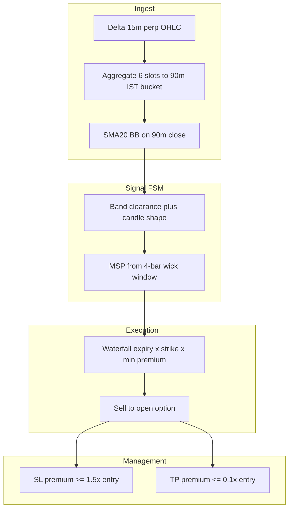
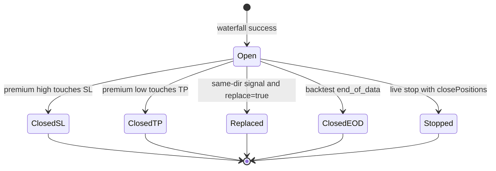

> **Archived product.** Directional Options Selling was removed 2026-06-30 and replaced by [SuperTrend Pullback Scaler (SPS)](./supertrend-pullback-scaler.md). This document is kept for historical reference only.

# Directional Options — Complete Strategy Reference (archived)

**Product:** Directional Options Selling (BB FSM)  
**UI route:** `/directional-options`  
**Tabs:** Backtest Lab · Live Engine · Trade History  
**Spec version:** 2026-07-12 (includes bracket SL/TP, ITM waterfall, replace-vs-skip)

This document is the **single technical and business-logic source of truth** for the strategy: what it tries to do, every rule, every default, every skip/exit reason, and how live execution differs from backtest simulation.

**Code roots:** `backend-python/cryptobridge/services/directional_options_seller.py`, `directional_options_service.py`, `utils/directional_options_backtest.py`, `utils/bollinger.py`, `utils/candle_aggregate.py`, `utils/options_market.py`, `utils/directional_options_helpers.py`

**Related:** [FEATURES.md §9](./FEATURES.md) (product inventory) · [CHANGELOG.md](./CHANGELOG.md) (history)

---

## Table of contents

1. [Business purpose](#1-business-purpose)
2. [Glossary](#2-glossary)
3. [Strategy at a glance](#3-strategy-at-a-glance)
4. [Instruments and market conventions](#4-instruments-and-market-conventions)
5. [90-minute bar construction](#5-90-minute-bar-construction)
6. [Bollinger Bands](#6-bollinger-bands)
7. [Signal FSM](#7-signal-fsm)
8. [MSP — strike anchor](#8-msp--strike-anchor)
9. [Execution waterfall](#9-execution-waterfall)
10. [Entry pricing — live vs backtest](#10-entry-pricing--live-vs-backtest)
11. [Trade management — SL and TP](#11-trade-management--sl-and-tp)
12. [Same-direction policy — replace vs skip](#12-same-direction-policy--replace-vs-skip)
13. [Opposite-direction and multi-leg rules](#13-opposite-direction-and-multi-leg-rules)
14. [Position sizing and PnL](#14-position-sizing-and-pnl)
15. [Live engine](#15-live-engine)
16. [Backtest engine](#16-backtest-engine)
17. [Configuration reference](#17-configuration-reference)
18. [REST API](#18-rest-api)
19. [WebSocket](#19-websocket)
20. [MongoDB collections](#20-mongodb-collections)
21. [Frontend flows](#21-frontend-flows)
22. [Diagnostics and chart verification](#22-diagnostics-and-chart-verification)
23. [Signal and trade lifecycles](#23-signal-and-trade-lifecycles)
24. [Complete reason-code index](#24-complete-reason-code-index)
25. [Live vs backtest parity](#25-live-vs-backtest-parity)
26. [Edge cases and limitations](#26-edge-cases-and-limitations)
27. [Troubleshooting FAQ](#27-troubleshooting-faq)
28. [Source file map](#28-source-file-map)

---

## 1. Business purpose

### 1.1 What the strategy sells

Directional Options is a **short-volatility options seller** on Delta Exchange:

- Sells **puts** when price stretches below the lower Bollinger band with a bullish-reversal candle (fade the downside extension).
- Sells **calls** when price stretches above the upper Bollinger band with a bearish-reversal candle (fade the upside extension).

Each leg is a **naked short option** managed with a premium-based stop-loss and take-profit. The engine does **not** delta-hedge the perp; directional bias is expressed only through which option type is sold.

### 1.2 Economic intent

| Leg | Market view | Premium collected | Risk |
|-----|-------------|-------------------|------|
| **Short put** | Bullish / mean-revert up from lower band | Put premium | Unlimited downside if spot collapses |
| **Short call** | Bearish / mean-revert down from upper band | Call premium | Unlimited upside if spot rips |

Profit comes from **premium decay** (theta) and favorable spot movement. Loss comes from **premium expansion** when spot moves against the short strike.

### 1.3 What “success” means in the product

- **Live:** Scanner detects closed 90m setups, opens listed options that pass the premium waterfall, manages SL/TP until flat.
- **Backtest:** Replays the same rules on historical 15m spot + option candles; produces a trade ledger, equity curve, and per-bar diagnostics explaining why signals did or did not become trades.

---

## 2. Glossary

| Term | Meaning |
|------|---------|
| **90m bar** | Synthetic OHLC bar built from six Delta **15m** perp candles in an IST-aligned bucket |
| **MSP** | Minimum Strike Price anchor — wick extreme over 4 bars used to seed the strike ladder |
| **Wick strike** | Nearest **listed** strike to MSP on the exchange ladder |
| **Waterfall** | Nested search: expiry (+1d, +2d) × strikes (wick, +1 ITM toward spot, +2 ITM toward spot) until min premium met |
| **Clearance** | Close must pierce the band by `bbClearancePct` beyond a simple touch |
| **Bracket SL/TP** | Stop at `entry × 1.5`, target at `entry × 0.1` (premium units) |
| **Signal** | FSM output: band clearance + candle shape on a **closed** 90m bar |
| **Executed** | Waterfall found a contract with sufficient premium and opened (or simulated open) |
| **Trade (ledger)** | A leg that **closed** with a recorded exit reason and PnL |
| **replaceSameDirection** | `true` = close existing same-direction leg and open new; `false` = keep existing, skip new signal |

---

## 3. Strategy at a glance



**Per closed 90m bar (after warmup):**

1. Compute BB on all completed 90m bars.
2. If FSM fires → compute MSP → run waterfall.
3. If waterfall succeeds → open short option (subject to same-direction policy).
4. On every live scan / backtest bar step → monitor open legs for SL/TP.
5. On same-direction signal with replace mode → close old leg at `replaced`.

---

## 4. Instruments and market conventions

| Item | Value |
|------|--------|
| Underlyings | **BTC**, **ETH** |
| Perp symbols (signal) | `BTCUSD`, `ETHUSD` |
| Option symbols | `P-BTC-{strike}-{DDMMYY}`, `C-ETH-{strike}-{DDMMYY}` |
| Signal timeframe | **90 minutes** (synthetic; see §5) |
| BB defaults | Length **20**, Mult **2**, MA **SMA**, Source **close**, Offset **0** |
| Timezone | **Asia/Kolkata (IST)** for buckets, bar-close expiry date, UI labels |
| Option settlement reference | `expiry_datetime_for_day` at **12:00 UTC** on expiry calendar day |

Delta REST has **no native 90m** candle resolution. All 90m logic aggregates from **15m** (`AGGREGATE_SOURCE = "15m"`, `BARS_PER_90M = 6`).

---

## 5. 90-minute bar construction

**Module:** `utils/candle_aggregate.py`

### 5.1 IST bucket schedule

Delta’s 90m chart opens at these **IST** times (16 buckets per day):

`01:00` · `02:30` · `04:00` · `05:30` · `07:00` · `08:30` · `10:00` · `11:30` · `13:00` · `14:30` · `16:00` · `17:30` · `19:00` · `20:30` · `22:00` · `23:30`

Assignment function: `delta_90m_bucket_open_unix(ts)` — uses IST wall-clock phase, **not** UTC midnight.

### 5.2 Six 15m slots per bucket

For bucket open time `T`:

| Slot | 15m open (open-stamped) | 15m close (close-stamped) |
|------|-------------------------|---------------------------|
| 0 | T | T + 15m |
| 1 | T + 15m | T + 30m |
| 2 | T + 30m | T + 45m |
| 3 | T + 45m | T + 60m |
| 4 | T + 60m | T + 75m |
| 5 | T + 75m | T + 90m (= next bucket open) |

The aggregator accepts **open-stamped** or **close-stamped** 15m series. A 15m candle stamped at the **next** bucket open is attributed to the **prior** bucket as slot 5 when needed.

### 5.3 Aggregated OHLC

| Field | Rule |
|-------|------|
| `open` | Open of slot 0 |
| `high` | `max(high)` across slots 0–5 |
| `low` | `min(low)` across slots 0–5 |
| `close` | Close of slot 5 |
| `time` | Bucket **open** (unix, IST-aligned) |
| `close_time` | `time + 5400` seconds (`DELTA_90M_SECONDS`) |

### 5.4 Completed vs in-progress

| Context | Rule |
|---------|------|
| **Live scanner** | Drop bucket if `now < bucket_open + 90m` |
| **Backtest** | Include every bucket with all six slots filled |

### 5.5 Evaluation timing (critical)

| Timestamp | Used for |
|-----------|----------|
| `bar.time` (bucket open) | FSM dedup, diagnostics `barTimeIst`, chart row match |
| `bar.time + 5400` (bucket close) | Entry premium lookup, expiry `today`, signal `barCloseTime` |

Using bar **close** for expiry avoids off-by-one symbol errors for signals between 00:00–05:30 IST.

### 5.6 Backtest fetch padding

Spot 15m fetch uses user date range **± 1 IST day** so edge buckets are not clipped.

### 5.7 Aggregation diagnostics (`aggregateStats`)

| Field | Meaning |
|-------|---------|
| `bucketsFormed` | Complete 90m bars built |
| `bucketsDroppedIncomplete` | One or more 15m slots missing |
| `bucketsDroppedInProgress` | Live-only: bucket still forming |
| `candidateBuckets` | Distinct bucket keys seen in input 15m series |

---

## 6. Bollinger Bands

**Module:** `utils/bollinger.py`  
**Aligned to:** TradingView defaults (Length 20, Mult 2, SMA, close, population stdev, offset 0).

### 6.1 Formula

For 90m close series `C` and bar index `i` where `i >= length - 1`:

```
basis[i] = (1/length) × Σ C[j]  for j in [i-length+1 .. i]

variance[i] = (1/length) × Σ (C[j] - basis[i])²
dev[i]      = sqrt(variance[i])     // population stdev (biased=true)

upper[i] = basis[i] + mult × dev[i]
lower[i] = basis[i] - mult × dev[i]
```

Implementation: explicit Pine-style loops (`pine_sma`, `pine_stdev`, `pine_bollinger_at`) — not pandas rolling.

### 6.2 Display vs raw

| Field | Purpose |
|-------|---------|
| `bb` | Tick-rounded for UI ($0.01 perp tick via `perp_tick_size_for`) |
| `bbRaw` | Full float precision for chart parity checks |

### 6.3 Warmup

| Requirement | Bars |
|-------------|------|
| BB valid | `bb_length` (default 20) |
| MSP window | 4 |
| **Effective FSM warmup** | `max(bb_length, MSP_LOOKBACK_BARS)` → default **20** completed 90m bars |

---

## 7. Signal FSM

**Class:** `DirectionalOptionFSM` (`services/directional_options_seller.py`)  
**Toolkit:** `utils/macd.py` — `calculate_macd`, `detect_macd_divergence`  
**Evaluated:** Once per **new** completed 90m bar (`last_bar_time` deduplication).

### 7.1 MACD parameters

| Field | Default | Notes |
|-------|---------|-------|
| `macdFast` | 12 | Fast EMA length |
| `macdSlow` | 26 | Slow EMA length |
| `macdSignal` | 9 | Signal EMA length |

Warmup: `max(macdSlow + macdSignal, 20)` completed 90m bars (divergence lookback = 20).

### 7.2 Divergence detection

`detect_macd_divergence(df)` scans the **last 20** candles for local extrema:

| Signal | Price | MACD |
|--------|-------|------|
| **Bullish** (short put) | Lower low (`Low_current < Low_previous`) | Higher low (`MACD_current > MACD_previous`) |
| **Bearish** (short call) | Higher high | Lower high |

The most recent swing point must be on the last or second-to-last bar in the window.

### 7.3 Pin bar confirmation

```
range = high - low
body  = |close - open|
pin   = range > 0  AND  body <= 0.3 × range
```

### 7.4 SHORT_PUT — sell put (“LONG” bias)

| # | Check | Requirement |
|---|-------|-------------|
| 1 | Divergence | `detect_macd_divergence` → **Bullish** |
| 2 | Shape | Pin bar on signal candle |
| 3 | Outcome | `short_put` → `SHORT_PUT` |

### 7.5 SHORT_CALL — sell call (“SHORT” bias)

| # | Check | Requirement |
|---|-------|-------------|
| 1 | Divergence | **Bearish** |
| 2 | Shape | Pin bar |
| 3 | Outcome | `short_call` → `SHORT_CALL` |

Put wins if both sides were ever valid on one bar (rare).

### 7.6 FSM no-signal `skipReason` values

| `skipReason` | When set |
|--------------|----------|
| `already_evaluated` | Same `bar.time` seen again |
| `no_divergence_detected` | No bullish/bearish divergence in the 20-bar scan |
| `no_rejection_wick` | Divergence present but the signal candle is not a pin bar |

### 7.7 FSM states (live)

| State | Usage |
|-------|--------|
| `IDLE` | Default |
| `ABORTED_INSUFFICIENT_PREMIUM` | Set when live waterfall fails on last signal |
| `EVALUATING`, `WATERFALL`, `OPEN`, `CLOSING` | Reserved / nominal — not actively transitioned |

### 7.8 `evaluate_bar_detailed` output shape

Per bar (after warmup): `barTime`, `barCloseTime`, `barTimeIst`, `ohlc`, `macd`, `macdRaw`, `checks`, `outcome`, `msp`, `direction`, `skipReason`, plus backtest `execution` block.

**`checks` fields:** `divergence`, `isPinBar`, `macdFast`, `macdSlow`, `macdSignal`.

---

## 8. MSP — strike anchor

**MSP** = wick extreme over the signal bar and prior three 90m bars (`MSP_LOOKBACK_BARS = 4`).

| Signal | MSP formula | Business meaning |
|--------|-------------|------------------|
| **SHORT_PUT** | `min(low)` over 4 bars | Lowest wick — anchor OTM put strikes near the flush low |
| **SHORT_CALL** | `max(high)` over 4 bars | Highest wick — anchor OTM call strikes near the extension high |

**Wick strike** = `nearest_strike(ladder, MSP)` — first strike tried in the waterfall.

---

## 9. Execution waterfall

After FSM + MSP, the engine searches for a **listed** contract whose premium meets the minimum.

### 9.1 Nested loop

```
today = IST calendar date of bar_close_time

for expiry_offset in (1, 2):           // next day, then day after
  expiry_day = today + expiry_offset
  for strike in itm_strikes_for_waterfall(msp, direction, ladder, step):
    premium = lookup(symbol, at bar_close_time)
    if premium >= min_premium:
      → OPEN this contract
```

### 9.2 Expiry

| Item | Rule |
|------|------|
| Offsets tried | **+1 day**, then **+2 days** from `today` |
| `today` | IST date of **bar close**, not bucket open |
| Settlement datetime | `expiry_datetime_for_day(expiry_day)` → 12:00 UTC |
| Symbol date suffix | `DDMMYY` e.g. `030726` = 3 Jul 2026 |

### 9.3 Minimum premium

```
min_premium = spot × (minPremiumPct / 100)
```

| Underlying | Default `minPremiumPct` | `MIN_PREMIUM_PCT` constant |
|------------|-------------------------|----------------------------|
| BTC | **1.2%** | 0.012 |
| ETH | **1.5%** | 0.015 |

`spot` = 90m bar **close** in backtest; live perp mark at scan time.

### 9.4 Strike ladder — ITM direction

**Toward spot** = more ITM on each step (higher premium, less OTM).

| Direction | Strike order (with listed ladder) |
|-----------|-----------------------------------|
| **Put** | Nearest to MSP → **+1 step higher** → **+2 steps higher** |
| **Call** | Nearest to MSP → **+1 step lower** → **+2 steps lower** |

Implementation (`itm_strikes_for_waterfall` in `options_market.py`):

- **Put:** ladder indices `[idx, idx+1, idx+2]` (clamp at top)
- **Call:** ladder indices `[idx, idx-1, idx-2]` (clamp at 0)

**Fallback** (no ladder): put adds `+step, +2×step`; call adds `-step, -2×step` to MSP via `round_strike`. Instrument steps via `get_strike_step(underlying)`: BTC **200**, ETH **10**.

Ladder source: `strike_grid_for_spot()` — listed strikes ±15% around spot merged with projected step grid.

### 9.5 Worked example — CE short (ETH)

**Setup:** 1 Jul 2026 **23:30 IST** bar close · spot **1700** · wick high **1718** · `minPremiumPct = 1.5%`

| Step | Value |
|------|-------|
| MSP | 1718 |
| Wick strike | **1720** (nearest listed) |
| Min premium | 1700 × 1.5% = **25.50** |

| Expiry | Strikes tried (premium) | Result |
|--------|-------------------------|--------|
| **2 Jul** | 1720 (12.00) → 1710 (16.00) → 1700 (20.80) | All &lt; 25.50 |
| **3 Jul** | 1720 (22.00) → **1710 (26.20)** | **Entry** |

**Entry:** `C-ETH-1710-030726` @ **26.20**  
**SL:** 26.20 × 1.5 = **39.30**  
**TP:** 26.20 × 0.1 = **2.62**

### 9.6 Worked example — PE short (mirror)

Same spot **1700**, wick low **1682**, wick strike **1680**, same min premium **25.50**:

| Expiry | Strikes tried | First pass |
|--------|---------------|------------|
| 2 Jul | 1680 → 1690 → 1700 | All fail min premium |
| 3 Jul | 1680 (22) → **1690 (26.20)** | Entry at 1690 put |

### 9.7 Waterfall skip reasons

| Reason | Meaning |
|--------|---------|
| `insufficient_premium` | Contract exists; premium &lt; min |
| `no_option_history` | No ticker / no historical 15m candles (backtest) |
| `waterfall_exhausted` | All 2 expiries × up to 3 strikes failed |
| `same_direction_open` | `replaceSameDirection=false` and same-direction leg already open (§12) |

---

## 10. Entry pricing — live vs backtest

| Context | Premium source | Timing |
|---------|----------------|--------|
| **Backtest** | Option **15m candle close** at or after `bar_close_time` (`_premium_at_or_after`) | Bar close |
| **Live waterfall** | Ticker mark (`mark_price` → `last_price` → `bid` → `ask`) | Scan moment (~60s after bar may have closed) |
| **Live fill** | `average_fill_price` from market sell if &gt; 0, else waterfall premium | Order response |

Backtest does **not** use Black-Scholes or synthetic premiums. Missing option history → skip (`no_option_history`).

---

## 11. Trade management — SL and TP

Short option legs: profit when premium **falls**, loss when premium **rises**.

### 11.1 Thresholds

```
stopPremium  = entry × 1.5     // 50% adverse move in premium
targetPremium = entry × 0.1    // 90% premium decay
```

Functions: `stop_loss_premium()`, `take_profit_premium()` in `options_market.py`.

### 11.2 Live monitoring

Every **60 seconds** (`SCAN_INTERVAL_SEC`), for each open leg:

```
if live_premium >= stopPremium  → close, exitReason "stop_loss"
if live_premium <= targetPremium → close, exitReason "take_profit"
```

- `live_premium` from option ticker mark (same priority as waterfall).
- Exit order: `place_market_reduce`, side **`buy`** (buy-to-cover).
- **Recorded exit premium:** exact `stopPremium` or `targetPremium` for SL/TP (bracket semantics). Other exits use live mark.

### 11.3 Backtest bracket simulation

**Module:** `bracket_exit_from_option_candles()` in `directional_options_helpers.py`

Scans option **15m OHLC** from `entry_time` to evaluation `end_time`:

```
for each candle (time-ordered):
  high = candle.high (fallback: close)
  low  = candle.low  (fallback: close)
  if high >= SL → exit at exact SL price, reason "stop_loss"    // SL first
  if low  <= TP → exit at exact TP price, reason "take_profit"
```

**Example:** entry **31** → SL **46.5**. A 15m candle with `high=81`, `close=81` exits at **46.5**, not 81.

SL is checked **before** TP on the same bar (conservative when both could trigger).

### 11.4 When brackets do not fire

Open legs continue to next bar iteration. Additional exit paths:

| `exitReason` | When |
|--------------|------|
| `replaced` | Same-direction signal with `replaceSameDirection=true` — closed at bar-close mark |
| `end_of_data` | Backtest ends with leg still open — closed at last bar close premium |
| `stopped` | Live `POST /stop` with `closePositions: true` |

---

## 12. Same-direction policy — replace vs skip

**Field:** `replaceSameDirection` (boolean, default **`true`**)

Parsed via `replace_same_direction_from_request()` / `coerce_replace_same_direction()` — explicit **`false`** must not be treated as missing (falsy-or bug was fixed 2026-07-12).

| Setting | UI label | Same-direction signal while leg open |
|---------|----------|--------------------------------------|
| **`true`** | Replace existing leg | Close existing (`replaced`) → open new leg |
| **`false`** | Keep existing (skip new signal) | **No new trade**; existing leg unchanged |

### 12.1 Live behavior

`_handle_signal_entry()`:

1. If `replaceSameDirection=false` and open same-direction trade exists → log skip, return `False`.
2. If `replaceSameDirection=true` → close all open same-direction trades (`replaced`), then open new.
3. Opposite direction is unaffected (§13).

### 12.2 Backtest behavior

Before `executed += 1`:

```
if not replace_same_direction and any open leg has signal.direction:
  skip with reason "same_direction_open"
  continue to next bar (no new SimPosition)
```

Replace path closes same-direction `SimPosition` via `_monitor_position` at bar close, sets `exitReason: replaced`.

### 12.3 What you should **not** see

With **Keep existing** (`false`), backtest trades must **not** have `exitReason: replaced` from same-direction signals. If they do, verify `result.params.replaceSameDirection === false` in the backtest output.

---

## 13. Opposite-direction and multi-leg rules

| Situation | Behavior |
|-----------|----------|
| **Put open + call signal** | Open call independently; both monitored separately |
| **Call open + put signal** | Open put independently |
| **Two puts** | Only if first closed — never two puts with `replaceSameDirection=false` |
| `conflictStatus` on insert | Always `"independent"` |
| Hedge / offset | **None** — legs are not netted |

One **scanner setup** per user per perp (`BTCUSD` / `ETHUSD`). BTC and ETH scanners can run concurrently.

---

## 14. Position sizing and PnL

### 14.1 Quantity semantics

`quantity` = **underlying coin amount** per leg (not lot count).

| Underlying | `contract_value` | `quantity = 1` → lots | Delta `order_size` |
|------------|------------------|----------------------|-------------------|
| BTC | 0.001 BTC/lot | **1000** | 1000 |
| ETH | 0.01 ETH/lot | **100** | 100 |

```
lots = floor(quantity / contract_value)
order_size = normalize_order_size(lots)
```

If `lots < 1`, PnL is **0** and live order size is **0**.

### 14.2 PnL formula (short option)

```
PnL = (entry_premium - exit_premium) × contract_value × lots
```

Matches short-option mark-to-market: gain when exit premium &lt; entry premium.

### 14.3 Stored trade fields

`quantity`, `quantityUnit` (BTC/ETH), `contractLots`, `contractValue`, `entryPremium`, `exitPremium`, `stopPremium`, `targetPremium`, `spotAtEntry`.

---

## 15. Live engine

**Services:** `DirectionalOptionsService` (API + WS) + `DirectionalOptionManager` (scanner, orders, Mongo)

### 15.1 Constants

| Constant | Value |
|----------|-------|
| `SCAN_INTERVAL_SEC` | 60 |
| `PREMIUM_PUBLISH_INTERVAL_SEC` | 1.0 |
| Live 15m lookback | 15 days |

### 15.2 Boot and recovery

On app start (`main.py`): `directional_options_service.start()` → `manager.resume_all()`:

- Reloads `enabled: true` setups from Mongo
- Rebuilds per `(userId, symbol)` FSM instances
- Restarts scanner asyncio tasks
- `ensure_symbols` for perp + open option symbols

Open trades persist in Mongo; scanner resumes monitoring them. **Stop** (`enabled: false`) does not close legs unless `closePositions: true`.

### 15.3 Scanner loop (per enabled setup)

```
every 60s:
  1. Load setup (bbLength, bbMult, bbClearancePct, relativeRangeMultiplier, rejectionWickRatio, minPremiumPct, quantity, replaceSameDirection)
  2. Fetch 15m perp candles (cache or REST)
  3. aggregate_delta_90m_bars(..., now=now) — drop in-progress bucket
  4. _refresh_bb_snapshot → setups[].bb for API/WS
  5. fsm.evaluate_bar() → TriggerSignal?
  6. strike_grid_for_spot(underlying, spot)
  7. Warm product cache (live put/call products)
  8. select_waterfall_candidate(premium_for=ticker)
  9. _handle_signal_entry() under per-(user,symbol) asyncio.Lock
 10. _monitor_open_trades() — SL/TP all open legs on this perp
```

### 15.4 Orders

| Action | Delta API | Side |
|--------|-----------|------|
| Entry | `place_order`, `market_order` | **sell** (sell-to-open) |
| Exit | `place_market_reduce` | **buy** (buy-to-cover) |

Credentials: `app_users.selectedAccountId` → account, else first listed account via `AccountService.credentials_for()`.

### 15.5 Live API payload (`GET /api/directional-options/live`)

| Key | Content |
|-----|---------|
| `type` | `"directional_options"` |
| `setups[]` | Enabled scanners + `bb` snapshot (last closed 90m bar) |
| `active[]` | Open legs: strike, expiry, entry/live premium, SL, TP, `premiumDirection` |
| `backtestJob` | In-memory job status if running |
| `updatedAt` | ISO timestamp |

### 15.6 BB panel (Live UI)

Last **closed** 90m bar: `barTimeIst`, spot, OHLC close, basis, upper, lower, std dev, clearance thresholds (`putMax`, `callMin`).

### 15.7 Premium direction flash

`premiumDirection`: `"down"` when live premium fell (favorable for short), `"up"` when rose. UI: green flash down, rose flash up.

---

## 16. Backtest engine

**Module:** `utils/directional_options_backtest.py`  
**Orchestration:** `DirectionalOptionsService.submit_backtest()` → async `_execute_backtest_job`

### 16.1 Validation and limits

| Rule | Value |
|------|-------|
| Underlyings | BTC, ETH only |
| Date order | `endDate >= startDate` |
| Max span | **120 days** |
| `quantity` | &gt; 0 |

### 16.2 Job lifecycle

1. Cancel prior user backtest task if still `processing`
2. Create job `{id, status: processing, submittedAt}`
3. Fetch 15m spot ±1 IST day padding
4. Build strike ladder from mean spot anchor
5. `run_directional_options_backtest()`
6. Set `status: completed|failed`, push via WebSocket
7. Frontend polls `GET /live` every 2s as fallback

### 16.3 Bar walk algorithm

```
open_positions = []
closed_trades = []

for each 90m bar from warmup index:
  1. Monitor all open_positions for SL/TP on option 15m OHLC → remove closed
  2. evaluate_bar_detailed() → diagnostics
  3. If no signal → append diagnostic, continue
  4. Run async waterfall on historical option 15m
  5. If waterfall fails → skip counters, continue
  6. If replaceSameDirection=false and same direction open → skip same_direction_open
  7. If replaceSameDirection=true → close same-direction positions (replaced)
  8. Append new SimPosition

After loop: force-close remaining open_positions → end_of_data
Build equity curve from closed_trades PnL (downsample max 400 points)
```

### 16.4 Result payload

| Field | Description |
|-------|-------------|
| `stats` | `numTrades`, `wins`, `losses`, `winRate`, `totalPnl`, `avgPnl`, `bestTrade`, `worstTrade`, `maxDrawdown` |
| `trades[]` | Closed legs with full entry/exit, PnL, `exitReason` |
| `equityCurve[]` | Cumulative PnL points |
| `params` | Includes `replaceSameDirection`, BB params, quantity |
| `bbBars[]` | Every 90m bar OHLC + `bb` + `bbRaw` |
| `signalDiagnostics[]` | Per-bar FSM + execution |
| `signalCount` | FSM triggers |
| `signalsExecuted` | Waterfall opens |
| `signalsSkipped` | Waterfall + same-direction skips |
| `signalsSkippedByReason` | Count map |
| `aggregateStats` | Bucket formation |
| `premiumSource` | `"historical"` |
| `candleCount` | Number of 90m bars |

### 16.5 Trade record schema

`date`, `direction`, `legType`, `strike`, `expiry`, `optionSymbol`, `entryTime`, `entryTimeIst`, `exitTime`, `exitTimeIst`, `entrySpot`, `exitSpot`, `entryPremium`, `exitPremium`, `totalPnl`, `realizedPnl`, `exitReason`, `quantity`, `quantityUnit`, `contractLots`, `contractValue`

---

## 17. Configuration reference

### 17.1 Backtest parameters

| Field | Type | Default | Notes |
|-------|------|---------|-------|
| `startDate` | ISO date | today − 30d | |
| `endDate` | ISO date | today | Max 120d span |
| `underlying` | BTC \| ETH | BTC | |
| `macdFast` | int ≥ 2 | 12 | Fast EMA |
| `macdSlow` | int ≥ 2 | 26 | Slow EMA |
| `macdSignal` | int ≥ 2 | 9 | Signal EMA |
| `minPremiumPct` | float ≥ 0 | 1.2 / 1.5 | Per underlying |
| `quantity` | float &gt; 0 | 1 | Coin units |
| `replaceSameDirection` | bool | **true** | See §12 |

**Persistence:** Mongo `directional_options_backtest_config` + browser `localStorage` key `directionalOptionsBacktestForm`.

### 17.2 Live parameters

| Field | Type | Default | Notes |
|-------|------|---------|-------|
| `symbol` | BTC \| ETH | BTC | Maps to `BTCUSD` / `ETHUSD` |
| `timeframe` | int | 90 | Only supported value |
| `macdFast` | int | 12 | |
| `macdSlow` | int | 26 | |
| `macdSignal` | int | 9 | |
| `minPremiumPct` | float | 1.2 / 1.5 | |
| `quantity` | float | 1 | |
| `replaceSameDirection` | bool | **true** | |

**Persistence:** Mongo `directional_options_setups` + `localStorage` key `directionalOptionsLiveForm`.

### 17.3 `coerce_replace_same_direction` accepted strings

| → `false` (keep existing) | → `true` (replace) |
|---------------------------|-------------------|
| `0`, `false`, `no`, `off`, `keep`, `keep_both`, `stack`, `skip` | `1`, `true`, `yes`, `on`, `replace` |

---

## 18. REST API

| Method | Path | Body / response |
|--------|------|-----------------|
| POST | `/api/directional-options/backtest` | Body: backtest params → `{id, status: processing}`; saves config |
| GET | `/api/directional-options/backtest/config` | Saved backtest defaults |
| PUT | `/api/directional-options/backtest/config` | Patch and persist form |
| POST | `/api/directional-options/start` | Start scanner; returns full live payload |
| POST | `/api/directional-options/stop` | `{symbol, closePositions?: bool}` |
| GET | `/api/directional-options/live` | Setups + active + backtestJob |
| GET | `/api/directional-options/active` | Alias of `/live` |
| GET | `/api/directional-options/history` | Up to **200** trade rows |

---

## 19. WebSocket

| Field | Value |
|-------|-------|
| Message `type` | `directional_options` |
| Payload | Same as `GET /live` |
| Throttle | ~1s per user when publishing on price ticks |
| Triggers | Start/stop, backtest job updates, `on_price_tick()` |

---

## 20. MongoDB collections

### 20.1 `directional_options_setups`

Unique index: `(userId, symbol)` where `symbol` is perp (`BTCUSD` / `ETHUSD`).

| Field | Type | Notes |
|-------|------|-------|
| `userId` | string | |
| `symbol` | string | Perp |
| `underlying` | string | BTC / ETH |
| `timeframe` | int | 90 |
| `bbLength`, `bbMult`, `bbClearancePct`, `relativeRangeMultiplier`, `rejectionWickRatio`, `minPremiumPct` | number | |
| `quantity` | number | Coin units |
| `replaceSameDirection` | bool | |
| `enabled` | bool | Scanner on/off |
| `updatedAt` | datetime | |

### 20.2 `directional_options_trades`

Indexes: `(userId, status)`, `(userId, symbol)`.

| Field | Type | Notes |
|-------|------|-------|
| `userId` | string | |
| `symbol` | string | Perp |
| `underlying` | string | |
| `direction` | string | `SHORT_PUT` \| `SHORT_CALL` |
| `legType` | string | `put` \| `call` |
| `strike` | number | |
| `expiry` | string | ISO date |
| `optionSymbol` | string | Full contract symbol |
| `entryPremium`, `livePremium`, `exitPremium` | number | |
| `stopPremium`, `targetPremium` | number | Bracket levels |
| `quantity`, `quantityUnit`, `contractLots`, `contractValue` | | Sizing |
| `status` | string | `open` \| `closed` |
| `conflictStatus` | string | `independent` |
| `exitReason` | string | See §24 |
| `orderId` | string? | Delta entry order |
| `spotAtEntry` | number | |
| `openedAt`, `updatedAt`, `closedAt` | datetime | |

### 20.3 `directional_options_backtest_config`

Unique: `userId`. Mirrors backtest form fields + `updatedAt`.

---

## 21. Frontend flows

### 21.1 Page shell

`DirectionalOptionsPage.jsx` — tabs: **Backtest Lab** (default), **Live Engine**, **Trade History**. Nav badge **Live** when any setup `enabled`.

### 21.2 Backtest Lab

- Open setup modal → run `POST /backtest`
- Auto-save form: `PUT /backtest/config` (debounced) + `localStorage`
- Results: stat boxes, skip-reason summary, `bbBars` table, `signalDiagnostics` table, equity curve, paginated trades
- Summary: `{numTrades} closed · {signalCount} signals · {signalsExecuted} opened · {signalsSkipped} skipped`
- Same-direction dropdown: **Replace existing leg** | **Keep existing (skip new signal)**

### 21.3 Live Engine

- Config panel → `POST /start` / `POST /stop` (`closePositions: false` in UI)
- Hydrate `GET /live` + WebSocket updates
- BB panel + active legs table with premium flash

### 21.4 Trade History

`GET /history` — computes PnL via `shortOptionPnl()` when not stored.

### 21.5 Utils

`directionalOptionsUtils.js`: `coerceReplaceSameDirection()`, `coinQtyToLots()`, `shortOptionPnl()`, form defaults, localStorage merge.

---

## 22. Diagnostics and chart verification

### 22.1 BB parity with TradingView / Delta

1. Chart: **90m**, BB **20 / 2 / SMA / close / offset 0**
2. Backtest Lab → **Bollinger bands (90m)** table
3. Match **`barTimeIst`** to chart bar **open** (IST)
4. Compare **`bbRaw`** (not tick-rounded `bb`)

### 22.2 Expected small differences

| Cause | Effect |
|-------|--------|
| Forming bar | Chart BB moves intrabar; we show last **closed** bar only |
| 6×15m aggregate vs native 90m | OHLC/BB may differ slightly |
| Tick rounding | UI `bb` rounds to $0.01 |

### 22.3 Signal diagnostics columns

Per 90m bar: IST time, outcome, OHLC, basis/bands, clearance flags, shape flags, `msp`, `skipReason`, `execution.status` (`opened` \| `skipped`), `execution.reason`, strike/expiry/premium when opened.

---

## 23. Signal and trade lifecycles

### 23.1 From chart touch to trade

```
Chart band touch (any bar state)
  → may fail clearance (bbClearancePct)
  → may fail candle shape (pin bar or body-outside)
  → may fail insufficient_candle_strength
  → SIGNAL (closed 90m bar)
  → waterfall may fail (premium / history)
  → may skip same_direction_open
  → EXECUTED (open leg)
  → TRADE in ledger only when leg CLOSES (SL/TP/replaced/end_of_data/stopped)
```

### 23.2 Open leg state machine



---

## 24. Complete reason-code index

### 24.1 FSM `skipReason` (diagnostics only)

`already_evaluated` · `no_divergence_detected` · `no_rejection_wick`

### 24.2 Execution / waterfall skip (`execution.reason`)

`insufficient_premium` · `no_option_history` · `waterfall_exhausted` · `same_direction_open`

### 24.3 Trade `exitReason`

| Reason | Live | Backtest |
|--------|------|----------|
| `stop_loss` | ✓ | ✓ (exact SL price) |
| `take_profit` | ✓ | ✓ (exact TP price) |
| `replaced` | ✓ (market mark) | ✓ (bar close mark) |
| `end_of_data` | — | ✓ |
| `stopped` | ✓ | — |

---

## 25. Live vs backtest parity

| Aspect | Live | Backtest |
|--------|------|----------|
| 90m aggregation | Drop in-progress | All complete buckets |
| Entry premium | Ticker mark + fill price | Option 15m close ≥ bar close |
| SL/TP trigger | Mark ≥ SL or ≤ TP | Option 15m high/low touch |
| SL/TP exit price | Exact bracket for SL/TP | Exact bracket for SL/TP |
| `replaced` exit price | Live mark | Bar close mark |
| Same-direction skip | Log only | `same_direction_open` in diagnostics |
| Waterfall failure | FSM `ABORTED_INSUFFICIENT_PREMIUM` | `signalsSkippedByReason` |
| Option missing | Skip at scan | `no_option_history` |
| Max positions same direction | 1 | 1 |

---

## 26. Edge cases and limitations

1. **No native 90m on Delta** — synthetic bars; small divergence from chart possible.
2. **Chart touches ≠ trades** — clearance, body-outside/pin shape, and min premium are stricter than visual touch.
3. **No synthetic option prices** — backtest requires historical option 15m candles.
4. **120-day backtest cap**; equity curve capped at 400 points.
5. **Only `timeframe=90`** supported — other values return HTTP 400.
6. **One open leg per direction per perp** — never two concurrent puts (or two calls) on same perp.
7. **`lots < 1`** → zero PnL and no live order.
8. **Live scan latency** — up to ~60s after bar close before signal evaluation.
9. **Stop scanner** — UI uses `closePositions: false`; open legs keep running without new signals.
10. **Concurrent backtests** — new job cancels previous for same user.
11. **Put before call** — if both clearances ever true, put signal wins (`elif` chain).
12. **Pin bar** — symmetric 30% body rule for both directions.
13. **Live replaced/stopped** — exit at market mark, not exact bracket.
14. **`end_of_data`** — not expiry settlement; uses last available option close.
15. **Credentials** — selected/first account; verify correct Delta API keys for options.
16. **FSM states** `EVALUATING`/`WATERFALL`/`OPEN`/`CLOSING` — unused in practice.
17. **WebSocket throttle** — premium updates max ~1 Hz per user.
18. **Exhaustion tuning** — `relativeRangeMultiplier` (default 1.5) and `rejectionWickRatio` (default 0.6) filter trend expansion from blow-off traps.

---

## 27. Troubleshooting FAQ

**Q: Backtest shows fewer trades than chart band touches?**  
A: Touches are not signals. Need clearance + parabolic spike + rejection wick + waterfall premium + same-direction policy.

**Q: BB values a few cents off chart?**  
A: Compare `bbRaw`; check 90m bar open time (IST); confirm 20/2/SMA/close settings.

**Q: Keep existing but still see `replaced`?**  
A: Check `result.params.replaceSameDirection` is `false`. Re-run after 2026-07-12 fix (explicit false parsing).

**Q: SL exit premium wrong (e.g. 81 instead of 46.5)?**  
A: Fixed 2026-07-12 — backtest uses bracket fill at exact SL, not candle close.

**Q: Why no live trade after signal?**  
A: Waterfall failed (insufficient premium / no ticker), same-direction skip, missing credentials, or `lots < 1`.

**Q: Put and call both open — is that normal?**  
A: Yes. Opposite directions are independent by design.

**Q: Scanner stopped but position still open?**  
A: Expected — stop disables new signals; use stop with `closePositions: true` to flat.

---

## 28. Source file map

| Concern | File |
|---------|------|
| FSM + sync waterfall | `services/directional_options_seller.py` |
| Live manager + backtest jobs + API glue | `services/directional_options_service.py` |
| Backtest simulation | `utils/directional_options_backtest.py` |
| PnL, lots, bracket exit, replace parsing | `utils/directional_options_helpers.py` |
| Strikes, expiry, premiums, ITM ladder | `utils/options_market.py` |
| BB math | `utils/bollinger.py` |
| 90m aggregation | `utils/candle_aggregate.py` |
| Strike grid fetch | `utils/strike_grid.py` |
| REST routes | `routers/directional_options.py` |
| App bootstrap | `main.py` |
| Backtest UI | `frontend-react/.../DirectionalOptionsBacktestTab.jsx` |
| Live UI | `frontend-react/.../DirectionalOptionsLiveTab.jsx` |
| History UI | `frontend-react/.../DirectionalOptionsHistoryTab.jsx` |
| Form utils | `frontend-react/.../directionalOptionsUtils.js` |
| Tests | `tests/test_directional_options_{fsm,service,backtest,live}.py` |

---

*End of document.*
